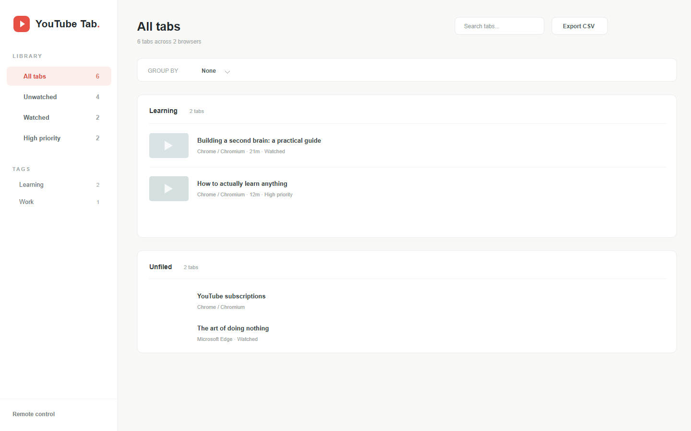
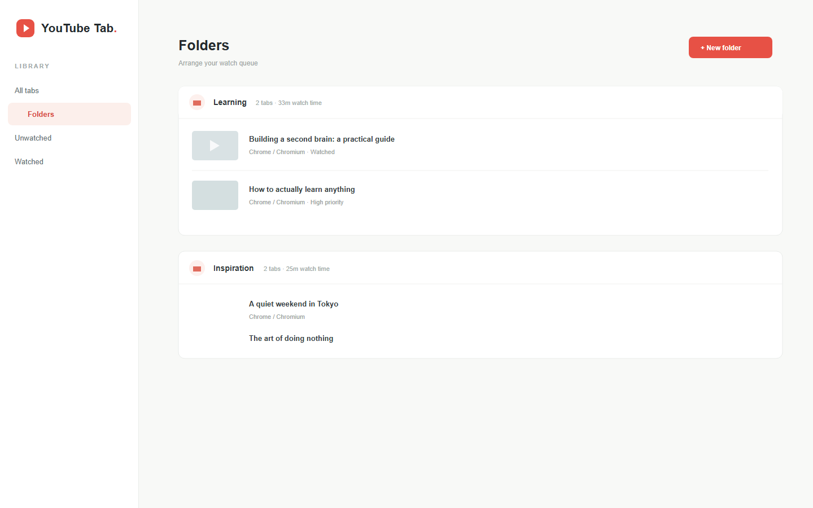

# YouTube Tab Desk

YouTube Tab Desk is a small Windows desktop app for turning a browser full of YouTube tabs into an organized watch queue. It collects tabs from Chrome, Edge, Brave, and other Chromium-based browsers, including windows on other virtual desktops.



## Features

- Track open YouTube tabs across browser windows and profiles.
- Filter tabs by watched status, priority, search text, or tag.
- Organize tabs into folders with drag-and-drop reordering.
- Persist labels, folders, and watch state locally between restarts.
- Mark videos watched manually or automatically after 80% playback.
- Export the organized queue as CSV.
- Switch directly to a browser tab from its title or thumbnail.
- Control the queue from another device through the authenticated local API.

## Installation

The Windows installer can be built with `npm run dist`. The installer includes the browser connector and API documentation.

For development, install [Node.js 20 or newer](https://nodejs.org/) and run:

```sh
npm install
npm run dev
```

Then install the connector in each browser profile you want to track:

1. Open `chrome://extensions` or `edge://extensions`.
2. Enable **Developer mode**.
3. Choose **Load unpacked** and select this project's `extension` folder.

The app's **Open extension folder** action opens the correct folder for you. The connector communicates with the desktop app only over `127.0.0.1:17349`, so the app must be running for tabs to appear.

## Organizing Tabs

Use the sidebar to switch between all, unwatched, watched, and priority tabs. Add tags to build focused queues, or use **Group by** to group the current view by status, priority, or tags.

Open **Folders** to create folders and drag tabs between them. Tabs without a folder appear in **Unfiled**. Deleting a folder moves its tabs to Unfiled. Folder placements follow a tab through app restarts, and restored browser tabs are matched by browser profile and URL.



## Remote Control

Open **Remote control** in the sidebar to copy the webhook URL and Bearer token. The authenticated API listens on `127.0.0.1:17350` by default. Enable **Allow local network** when commands should be accepted from another device on the same network.

See the [remote API reference](docs/REMOTE_API.md) for endpoints, action schemas, examples, CSV export, and error responses.

## Development

```sh
npm test       # Run the test suite
npm run build  # Build the renderer
npm run dist   # Build the Windows installer
```

## TODO

- [ ] Add support for multiple browsers and devices.
    - [ ] Add source device tag
    - [ ] Add add_device functionality
    - [ ] Make the sync engine

## License

YouTube Tab Desk is available under the [MIT License](LICENSE).
