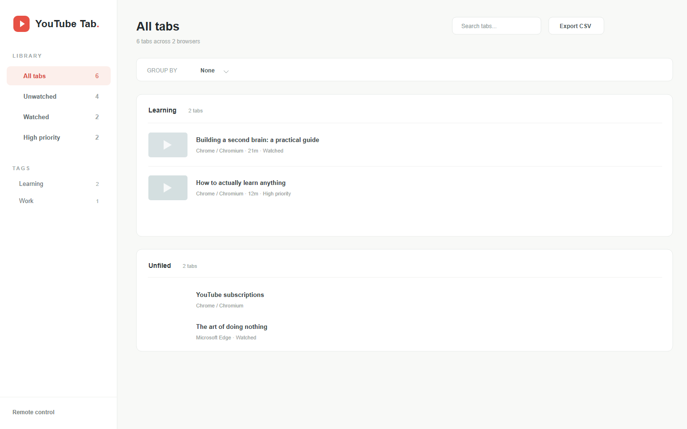
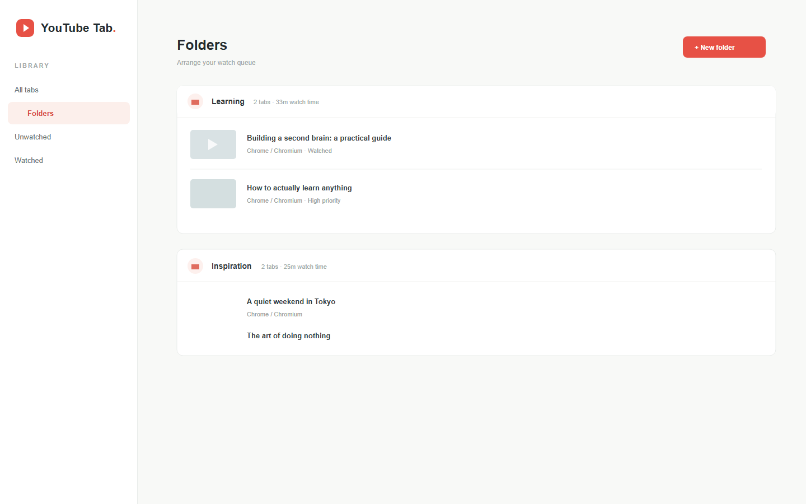

# YouTube Tab Desk

YouTube Tab Desk is a small Windows desktop app for turning a browser full of YouTube tabs into an organized watch queue. It collects tabs from Chrome, Edge, Brave, and other Chromium-based browsers, including windows on other virtual desktops.



## Features

- Track open YouTube tabs across browser windows, profiles, and computers on your local network.
- Identify each tab with browser/device source tags and Local or Remote badges.
- Filter or group tabs by source, and search by device or profile name.
- Filter tabs by watched status, priority, search text, or tag.
- Organize tabs into folders with drag-and-drop reordering.
- Persist labels, folders, and watch state locally between restarts.
- Mark videos watched manually or automatically after 80% playback.
- Export the organized queue as CSV.
- Switch directly to a browser tab from its title or thumbnail.
- Control the queue from another device through the authenticated local API.

## Installation

The Windows installer can be built with `npm run dist`. The installer includes the browser connector and API documentation.

For development, install [Node.js 20 or newer](https://nodejs.org/) and run:

```sh
npm install
npm run dev
```

Then install the connector in each browser profile you want to track:

1. Open `chrome://extensions` or `edge://extensions`.
2. Enable **Developer mode**.
3. Choose **Load unpacked** and select this project's `extension` folder.

The app's **Open extension folder** action opens the correct folder for you. By default, the connector communicates with the desktop app over `127.0.0.1:17349`, so the app must be running for tabs to appear. Each installed browser profile has its own persistent source ID; tabs from different browsers are collected together automatically.

### Connect a browser on another computer

1. On the receiving computer, open **Remote control**, keep **Enable webhook** on, and enable **Allow local network**.
2. Copy a network **Browser connector address** (for example, `ws://192.168.1.42:17350/connector`) and the **Bearer token**.
3. Copy the `extension` folder to the other computer and install it in the browser profile using the steps above.
4. Click the connector's toolbar icon to open its options. Paste the address and token, enter a **Device name**, and optionally enter a **Profile name** or override the browser name (useful for Brave).
5. Click **Save & connect** and grant access to the receiving host. The options page shows the connection status.

Every tab receives a source tag and a Local or Remote badge. Use **Sources** in the sidebar or **Group by → Source** to view a specific browser profile. Clicking a tab focuses it in its originating browser, including on the other computer. Watch state and user tags are shared for the same video, while folder placements stay separate for each tab instance. Disconnected sources disappear from the open-tab list and restore their placements when they reconnect.

Network connections use the existing remote-control port and token. Turning remote control off disconnects those connectors; rotating the token requires updating it in their options. The default local connector remains available independently. See the [remote API reference](docs/REMOTE_API.md) for network setup details.

## Organizing Tabs

Use the sidebar to switch between all, unwatched, watched, and priority tabs. Add tags to build focused queues, or use **Group by** to group the current view by status, priority, or tags.

Open **Folders** to create folders and drag tabs between them. Tabs without a folder appear in **Unfiled**. Deleting a folder moves its tabs to Unfiled. Folder placements follow a tab through app restarts, and restored browser tabs are matched by browser profile and URL.



## Remote Control

Open **Remote control** in the sidebar to copy the webhook URL and Bearer token. The authenticated API listens on `127.0.0.1:17350` by default. Enable **Allow local network** when commands should be accepted from another device on the same network.

See the [remote API reference](docs/REMOTE_API.md) for endpoints, action schemas, examples, CSV export, and error responses.

## Development

```sh
npm test       # Run the test suite
npm run build  # Build the renderer
npm run dist   # Build the Windows installer
```

## TODO

- [x] Add support for multiple browsers and devices.
    - [x] Add source device tag
    - [x] Configure a connector for another device
    - [x] Sync tabs, watch progress, and tab focus to the receiving app

## License

YouTube Tab Desk is available under the [MIT License](LICENSE).
